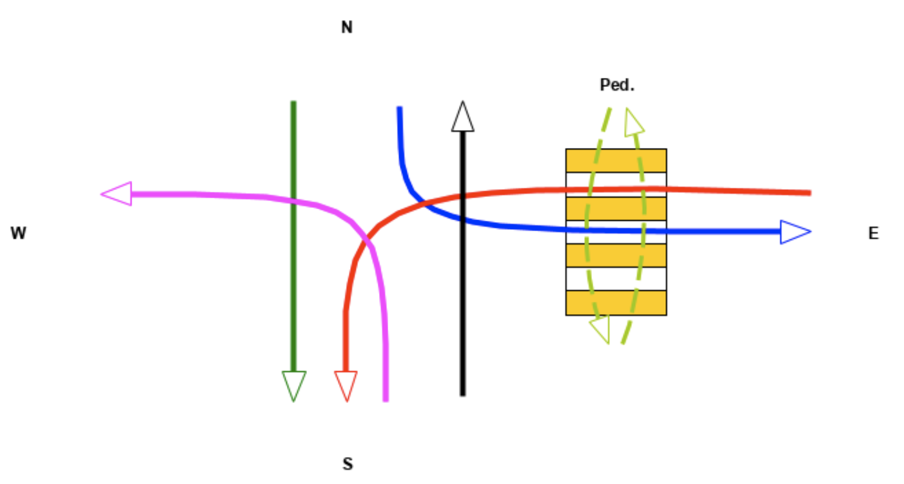

# HSE Formal Methods Traffic Lights Task

[`traffic-lights-trivial.pml`](traffic-lights-trivial.pml) contains a trivial example model from the task description.

[`traffic-lights-9.pml`](traffic-lights-9.pml) contains a model of the 9th configuration from the task.

[`traffic-lights-9-simple.pml`](traffic-lights-9-simple.pml) contains simplified model of the 9th configuration from the task.

[Description](description.md) contains the code comments.

[Verification](verification.md) contains the verification steps like `safete`, `liveness` and `fairness`.